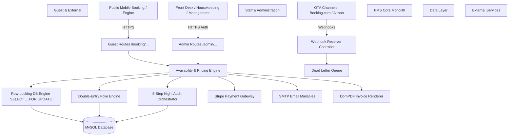

# Multi-Property Hotel Booking & Property Management System (PMS)

<p align="center">
  
  
  
  
  
  
</p>

---

## 📌 Executive Summary

The **Multi-Property Hotel Booking & Property Management System (PMS)** is an enterprise-grade, multi-tenant software solution built with Laravel 10. Designed for hospitality organizations managing multiple hotel properties, boutique resorts, and accommodation chains, the system seamlessly unifies guest-facing booking engines, front desk operations, double-entry financial accounting, housekeeping workflows, automated night audit execution, multi-channel OTA integration, and executive business analytics into a unified platform.

---

## 📑 Table of Contents

- [Core Architecture & Multi-Tenancy](#-core-architecture--multi-tenancy)
- [Comprehensive Feature Index](#-comprehensive-feature-index)
  - [1. Multi-Tenancy & Access Control](#1-multi-tenancy--access-control)
  - [2. Property, Inventory & Pricing Configuration](#2-property-inventory--pricing-configuration)
  - [3. Availability & Pricing Engine](#3-availability--pricing-engine)
  - [4. Reservation Core & State Machine](#4-reservation-core--state-machine)
  - [5. Public Mobile-First Booking Engine](#5-public-mobile-first-booking-engine)
  - [6. Payment Gateway, Mailables & PDF Invoicing](#6-payment-gateway-mailables--pdf-invoicing)
  - [7. Front Desk & Stay Management](#7-front-desk--stay-management)
  - [8. Double-Entry Guest Folios & Cashiering](#8-double-entry-guest-folios--cashiering)
  - [9. Housekeeping & Maintenance Management](#9-housekeeping--maintenance-management)
  - [10. Idempotent 5-Step Night Audit Orchestrator](#10-idempotent-5-step-night-audit-orchestrator)
  - [11. Business Intelligence, Reports & KPI Analytics](#11-business-intelligence-reports--kpi-analytics)
  - [12. Channel Manager & Webhook Ingestion](#12-channel-manager--webhook-ingestion)
  - [13. Security Hardening & System Health Diagnostics](#13-security-hardening--system-health-diagnostics)
  - [14. Corporate Allotments, Loyalty & Multi-Currency](#14-corporate-allotments-loyalty--multi-currency)
- [System Workflow & Architecture Diagram](#-system-workflow--architecture-diagram)
- [Route Directory](#-route-directory)
- [CLI Diagnostics & Health Verification](#-cli-diagnostics--health-verification)
- [Operational Runbook Reference](#-operational-runbook-reference)

---

## 🏗 Core Architecture & Multi-Tenancy

The platform employs a **Laravel Modular Monolith** architecture with strict multi-tenancy scoping:

* **Tenant Isolation:** Data models (`Property`, `Room`, `Reservation`, `FolioAccount`, etc.) are scoped to an `Organization` and a specific `Property`.
* **IoC Context Container Binding:** Dynamic `SetCurrentProperty` middleware extracts the property context per request and binds it to the application container.
* **Request Correlation Tracing:** `AttachCorrelationId` middleware injects unique UUID trace headers into incoming HTTP requests and audit logs for end-to-end telemetry.
* **Role-Based Access Control (RBAC):** Integrated via Spatie Laravel-Permission with pre-configured roles (`platform-admin`, `org-admin`, `general-manager`, `front-desk-agent`, `housekeeper`, `night-auditor`).
* **Audit Trail Engine:** Transactional event logging (`AuditLog` model & `AuditService`) capturing user activity, IP addresses, model changes, and execution timestamps.

---

## 🚀 Comprehensive Feature Index

### 1. Multi-Tenancy & Access Control
* **Organization & Property Hierarchies:** Manage multiple properties under parent corporate organizations.
* **User Management & Assignment:** Assign staff members to specific properties with dedicated roles and granular permission sets.
* **Property Switcher UI:** Seamless navbar dropdown for switching active property contexts without re-authenticating.
* **Rate-Limited Authentication:** Brute-force protection on staff login (5 attempts per minute throttling).

### 2. Property, Inventory & Pricing Configuration
* **Room Specifications:** Configurable room types with max adult/child occupancy limits, base pricing, and custom amenity tagging.
* **Physical Room Inventory:** Physical room numbers mapped to buildings, floors, and initial housekeeping states.
* **Rate Plan Management:** Support for flexible rate plans (Standard, Non-Refundable, Corporate, Seasonal) with deposit and cancellation policy bindings.
* **14-Day Rate Matrix Calendar:** Interactive daily rate calendar matrix allowing inline price updates for specific room types and dates.
* **Taxes & Fee Management:** Tax configuration supporting both percentage-based (e.g., VAT 10%) and fixed nightly fees (e.g., City Tax $3.50).

### 3. Availability & Pricing Engine
* **Atomic Row Locking (`SELECT ... FOR UPDATE`):** High-concurrency `AvailabilityService` preventing double-bookings and race conditions during simultaneous checkout operations.
* **Deterministic Pricing Engine:** Calculates base room rates, extra guest surcharges, and layered tax structures in minor integer currency units (cents) to avoid floating-point rounding errors.
* **Transient Inventory Holds:** 15-minute room holds created during guest checkout flows, backed by automatic background expiration cleanup.
* **Quote Inspector Tool:** Staff UI for simulating rate quotes, inspecting granular breakdown steps, and verifying dynamic pricing rules.

### 4. Reservation Core & State Machine
* **Strict Reservation State Machine:** Enforces valid status transitions:
  $$\text{Inquiry} \longrightarrow \text{Held} \longrightarrow \text{Confirmed} \longrightarrow \text{Checked In} \longrightarrow \text{Checked Out}$$
  with terminal states for $\text{Cancelled}$ and $\text{No-Show}$.
* **Human-Readable Confirmation Codes:** Property-coded confirmation strings (e.g., `TH001-202608-X89F`).
* **Guest Profiles:** Automatic lookup and resolution of returning guests based on email and phone identifiers.
* **Staff Reservation Creation:** Full back-office booking creation with add-on items, special requests, and nightly rate customization.

### 5. Public Mobile-First Booking Engine
* **Guest Booking Funnel (`/booking/{slug}`):** Modern responsive booking workflow:
  1. Room Availability Search
  2. Room Type Selection
  3. Optional Add-ons & Amenities Selection
  4. Guest Information & Special Requests
  5. Payment Review & Transient Hold Creation
  6. Instant Booking Confirmation
* **Embeddable Booking Widget:** Lightweight iframe/widget (`/{slug}/widget`) for external property marketing websites.
* **Guest Self-Service Portal:** Allows guests to lookup reservations using confirmation code and email (`/booking/portal/lookup`), view stay details, download PDF invoices, or request cancellations.

### 6. Payment Gateway, Mailables & PDF Invoicing
* **Stripe Payment Gateway:** `PaymentGateway` contract implementation with `StripeAdapter` supporting PaymentIntents and direct charge processing.
* **Stripe Webhook Receiver:** Handlers for automated processing of `payment_intent.succeeded` and `charge.failed` events.
* **Automated Mailable Notifications:** Transactional Blade emails for Booking Confirmation, Payment Receipts, Cancellation Confirmations, and Pre-Arrival Reminders.
* **DomPDF Invoice Generation:** Real-time generation of printable PDF guest invoices and receipts.

### 7. Front Desk & Stay Management
* **14-Day Interactive Tape Chart:** Visual Gantt-style timeline grid displaying physical room allocations, stay durations, and status badges.
* **Operational Roster Boards:** Live operational dashboards for Expected Arrivals, Expected Departures, and In-House Guests.
* **Check-In Workflow:** Room assignment verification, guest ID capture, key card assignment, and automatic status transition to `checked_in`.
* **Check-Out Workflow:** Folio zero-balance validation, key drop check, and automatic room transition to `dirty`.
* **Room Move Execution:** Live room changes during stay with rate adjustment handling and history tracking.

### 8. Double-Entry Guest Folios & Cashiering
* **Double-Entry Guest Ledger:** Accounting ledger composed of `FolioAccount`, `FolioWindow`, and `FolioTransaction` tracking charges, credits, and payments.
* **Staff Cashiering Actions:** Post manual room charges, food/beverage expenses, payments (Cash, Credit Card, Direct Bill), and line-item reversals.
* **Cashier Shift Balancing:** Shift opening/closing workflows with cash drawer balancing, float reconciliation, and audit summary logs.

### 9. Housekeeping & Maintenance Management
* **Housekeeping Kanban Board:** Real-time room status tracking across Clean, Dirty, Inspected, and Out of Order (OOO).
* **Task Allocation & Sign-off:** Task auto-generation based on stay departures, staff housekeeper assignment, and inspector approval workflow.
* **Maintenance Request Logging:** Maintenance ticketing system with urgency levels, issue descriptions, and room block linkages.

### 10. Idempotent 5-Step Night Audit Orchestrator
A 5-step transactional wizard for executing end-of-day property procedures:
1. **Pre-Audit Health Checks:** Verifies unhandled arrivals, unassigned rooms, and open cashier shifts.
2. **Automated Room & Tax Posting:** Posts nightly room charges and tax transactions across all in-house folios.
3. **No-Show Processing:** Automatically transitions unhandled arrivals to `no_show` and applies cancellation policies.
4. **Business Date Advance:** Transactionally increments property system date.
5. **Managerial Report Compilation:** Compiles daily KPI snapshot summaries and archives night audit logs.

### 11. Business Intelligence, Reports & KPI Analytics
* **Managerial KPI Engine (`KPIAnalyticsService`):** Real-time metrics calculations:
  * **ADR (Average Daily Rate):** $\frac{\text{Total Room Revenue}}{\text{Rooms Sold}}$
  * **RevPAR (Revenue Per Available Room):** $\frac{\text{Total Room Revenue}}{\text{Total Available Rooms}}$
  * **Occupancy Percentage:** $\frac{\text{Rooms Sold}}{\text{Total Available Rooms}} \times 100$
* **Executive Dashboard:** Interactive Chart.js visual charts (Revenue trends, Occupancy graphs, Channel distribution).
* **Data Export:** Instant CSV data streaming and executive managerial DomPDF downloads.

### 12. Channel Manager & Webhook Ingestion
* **OTA Channel Integration (`ChannelManagerService`):** Two-way synchronization interface for major channels (Booking.com, Airbnb, Expedia, Agoda).
* **Inbound Webhook Receiver Pipeline (`WebhookReceiverController`):** Validates external webhook signatures and deduplicates events via `provider_event_id`.
* **Dead-Letter Recovery Queue (`DeadLetterQueueController`):** Admin UI to inspect failed channel messages, view raw JSON payloads, and replay or discard dead-letter entries.

### 13. Security Hardening & System Health Diagnostics
* **Security Middleware (`SecureHeadersMiddleware`):** Injects security headers (`X-Frame-Options`, `X-Content-Type-Options`, `X-XSS-Protection`, `Referrer-Policy`).
* **Live System Health Dashboard (`/admin/system/health`):** Real-time monitoring of database connection latency, PHP/Laravel system metrics, storage space, and pending jobs.
* **Health Check CLI Command:** `php artisan pms:health-check` for automated production environment diagnostics.

### 14. Corporate Allotments, Loyalty & Multi-Currency
* **Multi-Currency Engine (`ExchangeRateService`):** Real-time rate conversion across USD, EUR, GBP, JPY, and CAD with locale-aware symbol formatting.
* **Guest Loyalty Tier Engine (`LoyaltyService`):** Tracks points earned on stays, tier status (Bronze, Silver, Gold, Platinum), manual adjustments, and tier auto-promotions.
* **Corporate Accounts & Group Allotments:** Corporate accounts with negotiated rate contracts, credit limits, room block allotments, and pickup rate analytics.

---

## 🗺 System Architecture Diagram



---

## 🛣 Route Directory

| URI | Method | Description | Target Controller |
| :--- | :--- | :--- | :--- |
| `/login` | `GET/POST` | Staff authentication portal | `Admin\AuthController` |
| `/admin/dashboard` | `GET` | Core PMS admin dashboard | `Admin\DashboardController` |
| `/admin/tape-chart` | `GET` | 14-day interactive stay grid | `Admin\FrontDeskController` |
| `/admin/reservations` | `GET/POST` | Reservation core management | `Admin\ReservationController` |
| `/admin/folios/{folio}` | `GET/POST` | Guest double-entry folio ledger | `Admin\FolioController` |
| `/admin/housekeeping` | `GET/POST` | Housekeeping Kanban & task board | `Admin\HousekeepingController` |
| `/admin/night-audit` | `POST` | 5-Step idempotent night audit run | `Admin\NightAuditController` |
| `/admin/reports` | `GET` | KPI reporting & CSV/PDF export | `Admin\ReportController` |
| `/admin/channel-manager` | `GET/POST` | OTA sync & connection state | `Admin\ChannelManagerController` |
| `/admin/dead-letter-queue` | `GET/POST` | Channel webhook error recovery | `Admin\DeadLetterQueueController` |
| `/admin/system/health` | `GET` | Live system health dashboard | `Admin\SystemHealthController` |
| `/booking/{slug}` | `GET` | Mobile-first guest booking engine | `Guest\BookingEngineController` |
| `/booking/portal/lookup` | `GET/POST` | Guest self-service stay portal | `Guest\GuestPortalController` |
| `/api/v1/webhooks/{provider}` | `POST` | Channel manager webhook receiver | `Api\WebhookReceiverController` |

---

## 🛠 CLI Diagnostics & Health Verification

The platform includes custom Artisan diagnostic tools to verify system integrity in staging and production environments:

```bash
# Run automated PMS health check diagnostics
php artisan pms:health-check
```

**Diagnostic Tests Performed:**
1. Database PDO Ping & Query Latency Timing.
2. Storage Folder Write Permission Verification (`storage/`, `bootstrap/cache/`).
3. Core Database Tables & Index Integrity Verification.

---

## 📖 Operational Runbook Reference

For operational deployment, night audit error handling, channel manager triage, and maintenance procedures, refer to the included runbook:

📄 **[OPERATIONAL_RUNBOOK.md](file:///var/www/html/booking/OPERATIONAL_RUNBOOK.md)**

For detailed phase-by-phase development history and progress verification:

📄 **[PROJECT_PHASES_STATUS.md](file:///var/www/html/booking/PROJECT_PHASES_STATUS.md)**

---

<p align="center">
  <b>Multi-Property Hotel Booking & PMS Platform</b> &bull; Built with Laravel 10 & MySQL
</p>
